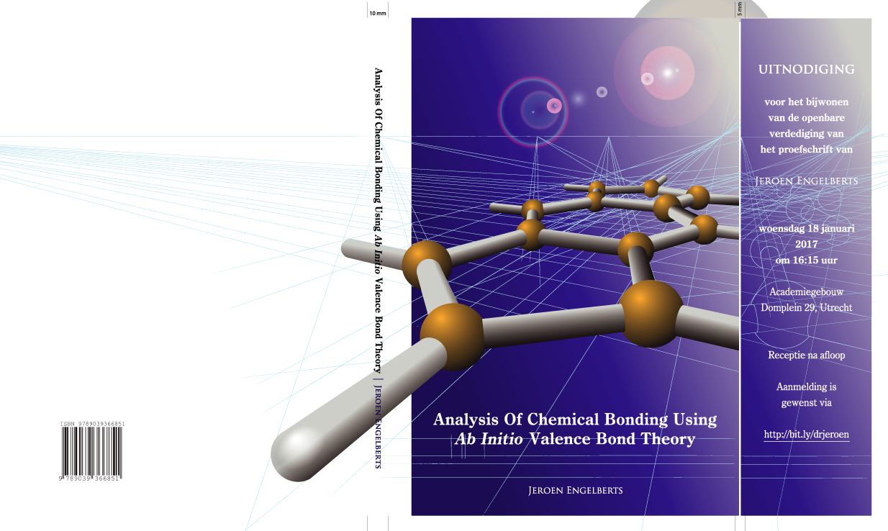

# My thesis / Mijn proefschrift
Welcome! This is the source distribution of my PhD thesis, as written between 2004 and 2016. If you would like the have a look at the PDF version that has been printed on November 30 2016, and defended on January 18 2017, please check [the library of Utrecht University](http://dspace.library.uu.nl/handle/1874/342336).

## Audience
If you are planning to create a large book, like a PhD thesis, or assemble a collection of multiple scientific articles, then the structure of my setup is at least worth a closer look.

## Advantages
* Each article, or chapter, has its own directory, resulting in clear cut separate entities. 
* Each of these chapters has *its own references* (yes, per chapter)
* PDFs can be created per chapter or, as one big file.
* The PDFs have a table of contents and clickable cross references.

## Tools needed
To build this thesis you need:

* TeX Live
* GNU make
* Ghostscript
 
TeX Live can be downloaded from [this](http://tug.org/texlive/) website.

On macOS and Linux, GNU make is installed by default. On Windows, you will also need to install a UNIX-like environment. I suggest you install the free version of [MobaXterm](https://mobaxterm.mobatek.net), which already has GNU make included. 

For the conversion of the figures, you will need [Ghostscript](https://www.ghostscript.com/). Free versions can be downloaded for your operating system.

**NB** Make sure that *make*, *epstopdf*, *pdflatex* and *bibtex* are in your PATH. Type *make* in the directory *proefschrift* to create the PDF of the whole thesis. Typing *make* in any of its subdirectories (excluding *main* and *cover*) will generate a PDF of that specific chapter, watermarked with the date and time of generation.
 
## Presentation
Inside the *orbopt* subdirectory, you will find a subdirectory called *presentation*. If you type *make* in there, an advanced PDF presentation will be created called *presentation.pdf*.

## Acknowledgement
I would like to thank [Michiel de Dood](http://www.molphys.leidenuniv.nl/~dood/resume.html) for publishing his class file (thesis.cls) back in the early 2000s. It really helped me on my way. Furthermore, I would like to thank [Roel Savert](https://www.linkedin.com/in/roel-savert-527a9a56/) for the design of the cover.
